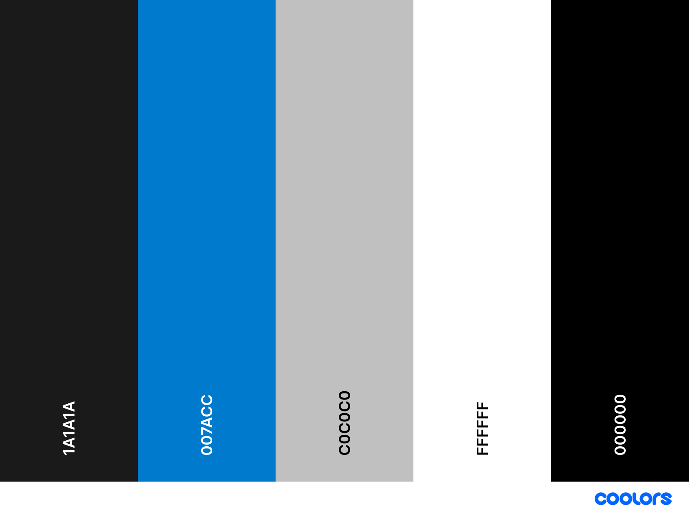

# Transcension Brand Book

This document outlines the official brand guidelines for **Transcension**, covering logo usage, color palette, typography, and design standards to ensure a cohesive and accessible brand identity.

## Brand Overview

**Transcension** represents innovation, professionalism, and accessibility in technology. Our brand assets are crafted to communicate a sleek, modern, and tech-focused identity, ensuring consistency and readability across all platforms and media.

## Logo

### Primary Logo

The primary logo includes the **Transcension** symbol and wordmark, with the wordmark set in [**Montserrat Semi-Bold**](https://fonts.google.com/specimen/Montserrat). The wordmark has been adjusted for a tighter width to enhance readability and maintain a sleek aesthetic.

### Logo Usage

- **Primary Backgrounds**: Use the logo in white on dark backgrounds (e.g., #1A1A1A or black #000000).
- **Light Backgrounds**: Use the logo in black or the dark blue (#007ACC) on white (#FFFFFF) or light gray (#C0C0C0) backgrounds.

Ensure there is adequate whitespace around the logo for clarity and visual balance.

### Logo Variations

| Logo Variation            | Use Case                                    | Preview                                   |
|---------------------------|---------------------------------------------|-------------------------------------------|
| **Symbol Black & White**  | Monochrome use on light or dark backgrounds |      |
| **Symbol Colour**         | Full-color version for digital and print    |  |
| **Wordmark Black**        | Monochrome use on light backgrounds         |  |
| **Wordmark White**        | White wordmark on dark backgrounds          |  |
| **Wordmark Blue & White**        | Blue wordmark on light backgrounds          |  |
| **Wordmark Blue & Black**       | Blue wordmark on dark backgrounds          |  |
| **Wordmark Colour**      | Full-color version for digital and print    |  |

## Color Palette

Our color palette has been chosen to balance accessibility, professionalism, and modernity. Each color has a specific role to ensure brand consistency, readability, and impact.

### Primary Colors

- **Dark Background** (#1A1A1A)
  - **Use**: Main background for digital and print media, creating a strong, professional foundation.

- **Electric Blue** (#007ACC)
  - **Use**: Primary accent color for call-to-action elements, highlights, and logo symbols.

### Secondary Colors

- **Gray** (#C0C0C0)
  - **Use**: Backgrounds, borders, secondary text, and subtle accents.

### Neutral Colors

- **White** (#FFFFFF)
  - **Use**: Backgrounds, primary text on dark backgrounds, and clean layouts.

- **Black** (#000000)
  - **Use**: Primary text on light backgrounds, high-contrast elements, and monochrome logo variations.

### Accent Colors

To achieve a synthwave or vaporwave feel, a complementary purple accent will enhance the aesthetic and blend well with the existing blues.

- **Neon Purple** (#A020F0)
  - **Use**: This vibrant purple has a strong neon quality, making it an ideal accent for a synthwave look. It contrasts well with the electric blue and can be used sparingly to highlight specific elements, giving a retro-futuristic vibe.

## Typography

Our primary typeface is [**Montserrat Semi-Bold**](https://fonts.google.com/specimen/Montserrat), modified for a tighter width to give a modern, streamlined appearance that aligns with Transcension’s tech-focused identity.

**Font Pairing**: For body text in longer documents, pair Montserrat with simple sans-serif fonts like Arial or Helvetica to maintain a clean and professional look.

## Usage Guidelines

- **Logo Spacing**: Ensure sufficient whitespace around the logo for clarity and impact.
- **Accent Colors**: Use **Electric Blue (#007ACC)** sparingly to highlight interactive or key elements and **Gray (#C0C0C0)** for softer background sections or secondary content.
- **Neutral Balance**: Use **Gray (#C0C0C0)** for subtle design elements like borders, backgrounds, and secondary text, enhancing readability without competing with primary colors.
